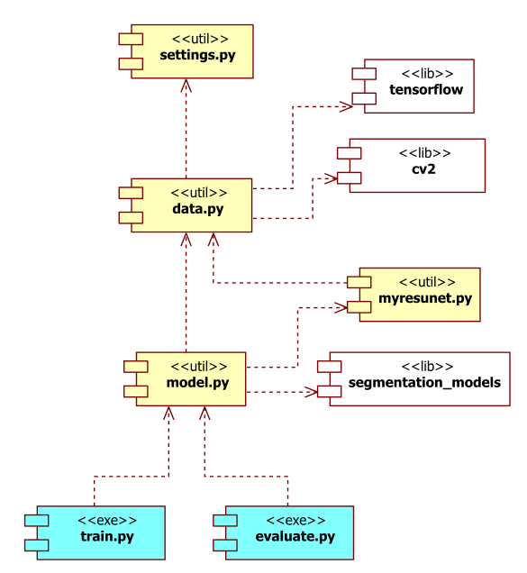

# CamVid Segmentation
## Deep Learning-based Semantic Segmentation for Autonomous Driving 

This project was developed as a part of the presentation that I gave on 
[Programming 2.0 webinar: Autonomous driving](https://www.linkedin.com/comm/events/programming2-0webinara-autonomo6755030263207665664/?midToken=AQFX82zhIzGESQ&midSig=0sAnpP38IfB9A1&trk=eml-email_attendee_confirmation_01-null-1-null&trkEmail=eml-email_attendee_confirmation_01-null-1-null-null-20bu8g%7Ekjv6l6my%7Ek1-null-neptune%2Fprofessional%7Eevent%2Eoverview&lipi=urn%3Ali%3Apage%3Aemail_email_attendee_confirmation_01%3BTGiLQOQHQgGgOx7%2FeYPiiw%3D%3D).

The presentation slides can be found here: 
[programming_2_0.pdf](./docs/programming_2_0.pdf)

### Instructions 

To be able to use the code please follow listed instructions:

1)  Download data from https://www.kaggle.com/carlolepelaars/camvid
 
2)  Extract files and place them into *data* folder using the following folder structure:
    ```    
    data/test/*.png
    data/test_labels/*.png
    data/train/*.png
    data/train_labels/*.png
    data/val/*.png
    data/val_labels/*.png
    data/class_dict.csv
    ```

4) Execute *train.py* to train the model based. The results will be placed in *tmp* folder. In case of an out of memory problem, adjust *batch size* in *settings.py*:  
   ```
   batch_size = 4
   ```
   
5) Execute *evaluate.py* to evaluate trained model on the test subset. The results will be placed in *tmp* folder.

6) Check *settings.py* for other training options.

### Project Overview

Please overview UML diagram that depicts major project components and dependencies:



The project have two executable scripts: 
* *train.py* - used to train a model.
* *evaluate.py* - used to evaluate trained model against *test* set.

There is also several utility scripts with the following responsibilities:
* *settings.py* - add project related settings.
* *data.py* - utility variables, functions, and classes responsible for accessing dataset images. 
  * Relies on *tensorflow* and *cv2* libs.
* *model.py* - utility functions used to create segmentation model. 
  * Relies on *myresunet.py* script and *segmentation_models* lib.
* *myresunet.py* - utility functions used to create custom U-Net/ResNet inspired model.

For more info about *segmentation_models* lib please check its GitHub page:
https://github.com/qubvel/segmentation_models

### Experiments

A list of conducted experiments with appropriate accuracy achieved on the test set is reported in 
[experiments.py](./results/experiments.csv).

The best accuracy of 90.05% (min. 70.86%, max. 97.40%, std. 5.68%) were achieved with U-Net model and EfficientNetB2 backbone. 
The trained model along with all other outputs for that experiment can be found 
[here](./results/unet_efficientnetb2_bs4/).
